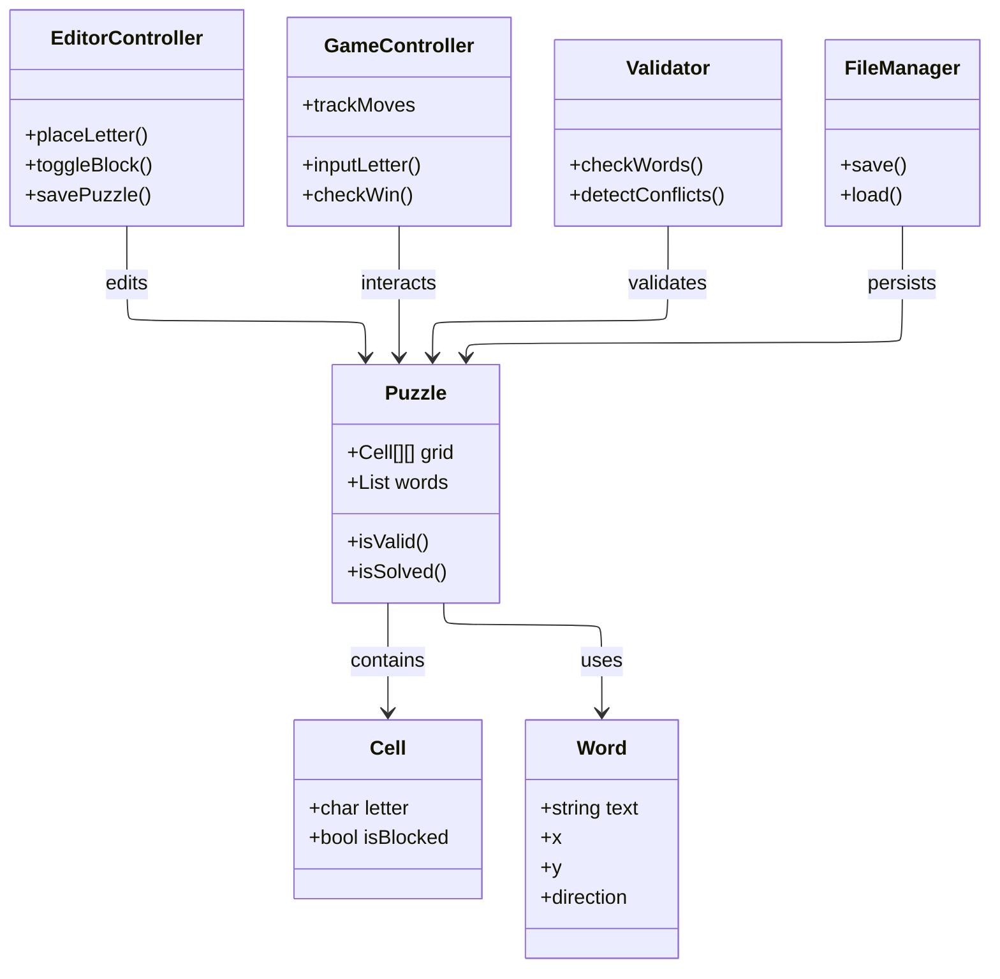

# Word-Forge

```mermaid
%%{init: {"layout": "elk"}}%%
classDiagram
class Puzzle {
  +Cell[][] grid
  +List<Word> words
  +isValid()
  +isSolved()
}

class Cell {
  +char letter
  +bool isBlocked
}

class Word {
  +string text
  +x
  +y
  +direction
}

class EditorController {
  +placeLetter()
  +toggleBlock()
  +savePuzzle()
}

class GameController {
  +inputLetter()
  +trackMoves
  +checkWin()
}

class Validator {
  +checkWords()
  +detectConflicts()
}

class FileManager {
  +save()
  +load()
}

Puzzle --> Cell : contains
Puzzle --> Word : uses
EditorController --> Puzzle : edits
GameController --> Puzzle : interacts
Validator --> Puzzle : validates
FileManager --> Puzzle : persists
```
